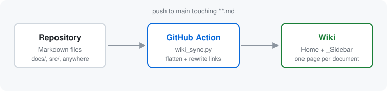

# Pipeline Overview

A push to `main` that touches any Markdown file triggers
[`.github/workflows/wiki-sync.yml`](../../.github/workflows/wiki-sync.yml), which runs
[`tools/wiki_sync.py`](../../tools/wiki_sync.py) and pushes the result into the wiki's
backing Git repository.

## Why paths are flattened

A GitHub wiki is a flat namespace. A page committed to `sub/dir/Page.md` is still
served at `/wiki/Page`, so two files sharing a basename collide and one silently
disappears. Folding the whole path into the page name makes collisions impossible:

| Source file | Wiki page | Displayed title |
| --- | --- | --- |
| `docs/getting-started.md` | `Docs-Getting-Started` | Docs Getting Started |
| `docs/architecture/overview.md` | `Docs-Architecture-Overview` | Docs Architecture Overview |
| `docs/architecture/README.md` | `Docs-Architecture` | Docs Architecture |

Hyphens are the separator because GitHub renders a hyphen in a wiki filename as a
space in the page title. That behaviour cannot be disabled, so the naming scheme
uses it rather than fighting it.

## What gets rewritten

Relative links only make sense in the original directory layout, so the generator
rewrites them as it copies:

- A link to another Markdown file becomes a link to its wiki page, preserving any
  `#anchor`.
- A relative image becomes an absolute `raw.githubusercontent.com` URL, because the
  wiki cannot serve files out of the code repository.
- A relative link to any other repository file becomes a `blob` URL on GitHub.
- Anything already absolute is left alone, and nothing inside a fenced code block or
  an inline code span is touched.

A link that resolves to nothing is reported as a warning, and pull request CI turns
those warnings into a failure so a broken reference is caught before it reaches the
wiki.

## Generated navigation

Three pages are produced from the page list rather than from any source file:

- `Home` — the intro, a recently updated list built from `git log`, and a full index
  grouped by top-level directory.
- `_Sidebar` — the same grouping, rendered as navigation on every page.
- `_Footer` — the commit the wiki was built from.

This is what makes the wiki grow on its own. Adding a Markdown file is enough to get
it indexed, linked, and navigable.

## Backlinks

Resolving a link already tells the generator which page points at which, so the
reverse of that graph comes for free. Every page ends with a **Referenced by** list
of the documents that link to it, which is what keeps a growing pile of files
readable as a connected set rather than a flat index.

A page that nothing links to is an orphan, and orphans get their own section on the
generated `Home` page. Only links written in real documents count toward this;
`Home` and `_Sidebar` link to everything, so counting generated navigation would
mean no page was ever an orphan.

Set `"backlinks": false` in [`wiki.config.json`](../../wiki.config.json) to turn the
whole feature off.

## One-way by design

The sync deletes wiki pages that no longer have a source file, which means the
repository is the only source of truth. Editing a page in the wiki UI will work until
the next push to `main` overwrites it, so every generated page carries a banner
saying so.
